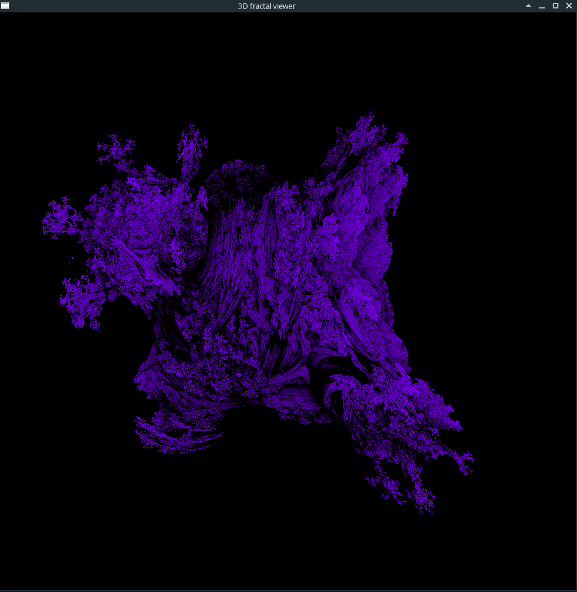

# cuda_fractal_3D
A simple distance estimation fractal viewer, using SFML and CUDA.

Currently only the mandelbulb fractal has been added. 

# Compile 
Tested with cuda 11.3 and SFML 2.5 on Arch Linux

nvcc mandelbulb.cu -o fractal -lsfml-window  -lsfml-graphics -lsfml-system 

# Controls
The arrow keys control the rotation, middle mouse button crontrols the zoom in and zoom out, P starts/stops the animation.

## Screen shots

